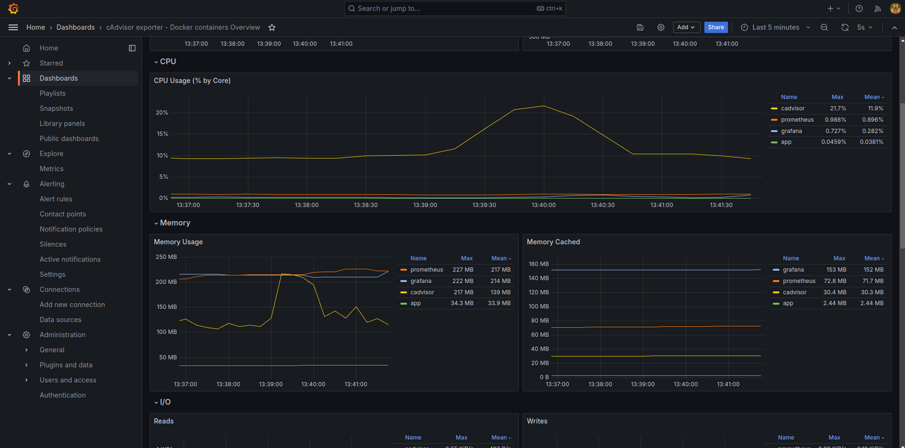
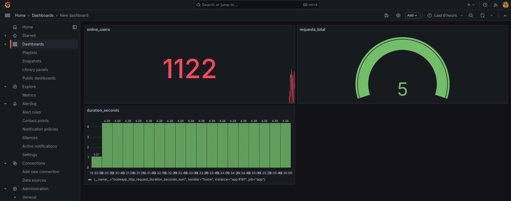

# Prometheus + Grafana + Cadvisor

Uma simples implementação do Prometheus para coletar métricas da API, dos containers rodando na minha máquina e exibindo essas métricas no Grafana.

P.S.: não configurei volumes persistentes no Docker Compose; dessa forma, se os containers caírem, as métricas coletadas não serão salvas.

**Para rodar o preojeto**

```bash
 docker compose up --build -d
```




